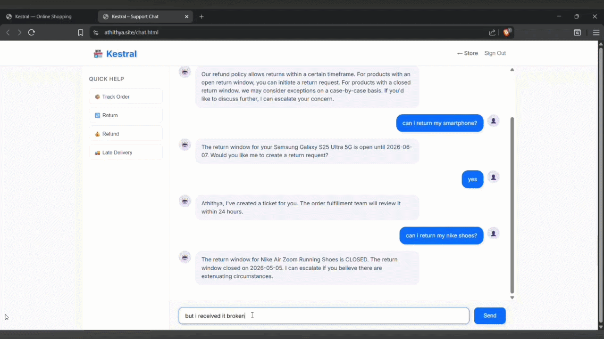

# TicketWeave

## `TicketWeave` is a support-triage agent built around two constraints: `inference cost` and `agent safety`

### It receives customer messages over WebSocket, classifies every message before any tool runs, and routes the request to the appropriate support team via a deterministic intent-to-team map. Refunds, credits, pickup scheduling, and other customer-impacting operations are intentionally excluded — the agent's job is to assist human decision-making, not to act autonomously.

#### The result runs on **~$23/month of infrastructure with zero inbound ports**, secured by a **5-layer architecture** spanning edge (Cloudflare Tunnel + WAF), application (OIDC + short-TTL JWT), container (non-root + Trivy), network (private subnets + least-privilege IAM), and data (SSM Parameter Store + RDS encryption).

**Core stack:** `Amazon ECS` · `Cloudflare Tunnel` · `FastAPI` · `LangGraph` · `DSPy` · `Amazon Bedrock (Llama 3 8B)` · `FastMCP` · `PostgreSQL` · `S3` · `DynamoDB` · `RDS` · `OWASP ZAP`

---

## At a glance

| Metric                                    |            Result |
| ----------------------------------------- | ----------------: |
| **Infrastructure cost (staging)**         |    **~$23/month** |
| **Infrastructure cost (production)**      |    **~$38/month** |
| **Inline policy retrieval latency**       |         **<5 ms** |
| **DAST critical findings**                |             **0** |
| **DAST high findings**                    |             **0** |
| **Inbound application ports**             |             **0** |
| **JWT lifetime**                          |    **15 minutes** |
| **Team assignment**                       | **Deterministic** |

> **Measurement note:** The figures above reflect the architecture, configuration, and recorded scan/cost estimates in this repository. Actual AWS costs, latency, and security-scan results will vary with region, workload, traffic, and configuration.

---




### Notes on the demo

The GIF shows a two-turn escalation: the customer asks about returning a pair of shoes, is told the return window has closed, replies that the item arrived damaged, and confirms escalation.

**1. Return-window math is done in Python, not by the LLM.**  
The agent computes `delivery_date + return_window_days` and injects it as plain text (`OPEN until 2026-05-24` or `CLOSED since 2026-05-05`). The model only echoes the pre-computed status. This keeps hallucination risk on factual fields near zero.

**2. Confirmations and escalations bypass the LLM entirely.**  
"yes escalate" carries no new intent. Rather than pay for a second inference call, the agent strips confirmation words, assembles the ticket from graph state, and routes to `service_center` with a 2-hour SLA. The v1 limitation: the summary on this path uses current-turn state only, so a pure confirmation can fall back to a generic string. A one-turn lookback is planned for v2.

**3. What the LLM does *not* decide**

- **Team assignment** is a hard-coded `INTENT → TEAM` table.
- **Priority** is derived from the urgency score (`≥9 → critical`, `≥7 → high`, else `medium`).
- **Return-window status** is computed in Python — for the demo order (Nike Air Zoom Running Shoes, delivered 2026-04-25, 10-day window) the status is `CLOSED since 2026-05-05` — and injected as plain text.
- **Order filtering** narrows the order list to the ones the customer actually mentioned, before the prompt is built.

---

## How the Agent Is Constrained

Four LangGraph nodes. Full implementation notes in [docs/agent_service.md](docs/agent_service.md).

1. **Guardrail classifier** — DSPy-compiled triage program (Llama 3 8B, temperature 0) classifies safety, intent, urgency, and sentiment. Compiled from 50 labeled examples using `BootstrapFewShot`. Every message is classified **before** any context is fetched or any tool is called. Unsafe → immediate human escalation.
2. **Context gatherer** — Fetches customer profile and last 5 orders (with product names) from the MCP server. Skips gracefully if no customer identifier is present.
3. **Conversational agent** — LLM with two tools: `search_policies` (inline RAG) and `create_ticket`. Policy questions get an instant answer; issues needing human action produce a structured ticket with a concise summary and suggested action.
4. **Human escalate** — Skips the LLM entirely; creates a high-priority ticket via MCP for messages the guardrail rejects.


| Intent | Team |
|--------|------|
| `return_request` · `cancellation_request` · `wrong_item_delivered` | `order_fulfillment` |
| `refund_status` · `payment_issue` | `payments` |
| `late_delivery` · `delivery_issue` | `logistics` |
| `damaged_product` · `defective_product` | `service_center` |
| `account_issue` · `complaint` | `senior_support` |
| `general_inquiry` (and any unmapped intent) | `general_support` |


---

## System Architecture


**Networking flow:**
```
Internet → Cloudflare Tunnel → ECS Host (host network mode) → Agent Service → MCP Server → RDS
```

- **Zero inbound ports:** Security groups have no ingress rules; all traffic enters via Cloudflare Tunnel
- **No load balancer:** Cloudflare Tunnel terminates on each EC2 host, eliminating ALB/NLB costs
- **Private subnets:** RDS PostgreSQL deployed in private subnets, accessible only from ECS hosts

Full details in [docs/architecture.md](docs/architecture.md).

---

### Cost-aware inference

To keep average Bedrock spend low, several branches avoid the LLM entirely:

- Policy lookups are answered directly from RAG chunks rather than re-summarized.
- Return-window dates are pre-computed in Python and injected into the prompt as plain text.
- Orders are filtered to the relevant ones before the prompt is built.
- Confirmations ("yes", "ok", "go ahead") and escalations bypass the LLM; the ticket is assembled from existing graph state.

### State & persistence

All conversation state is checkpointed to PostgreSQL after every node via `AsyncPostgresSaver` — the agent survives restarts and resumes any in-flight conversation.

### MCP server

Three tools exposed over FastMCP: `lookup_customer`, `get_recent_orders`, `create_ticket`. It owns **no decision logic** — all routing, summarization, and policy decisions stay in the agent. Details in [docs/mcp_server.md](docs/mcp_server.md).

### Inline RAG

Policy documents are pre-embedded with Bedrock Titan v2, stored as a single ~1.3 MB JSON file in S3, loaded once at startup, and searched with in-process NumPy cosine similarity (<5 ms). No vector database required. Details in [docs/serverless_rag.md](docs/serverless_rag.md).

---

## Failure Handling

The system is designed to degrade predictably rather than fail silently.

| Scenario | Behavior |
|---|---|
| **LLM returns malformed JSON** | Re-prompted with a corrective message, up to 5 reasoning steps. On exhaustion, the customer receives a generic human-escalation response and a ticket is created. |
| **Bedrock rate limit (429)** | Exponential backoff (2^attempt), up to 3 retries per call. |
| **MCP server cold start** | Client retries connection up to 5 times over ~10 seconds before raising. |
| **Container restart mid-conversation** | Graph state is checkpointed to Postgres after every node; the next message resumes from the last checkpoint. |
| **No customer match / no email** | Context gathering is skipped; the agent answers from policy RAG only. |
| **Transient Bedrock error during context lookup** | Context gatherer returns `customer_context: None`; the agent still produces a response and can escalate to a human. |
| **Guardrail false positive** | A second string check against a small hard-coded token set prevents DSPy false positives from silently swallowing a customer message. |

---

## Security — 5 Layers

```
Edge (Cloudflare) → Application (FastAPI) → Container (Docker) → Network (AWS) → Data (PostgreSQL/SSM)
```

| Layer | Controls |
|-------|---------|
| **Edge** | Cloudflare Tunnel (mTLS, SSL strict), WAF (OWASP Top 10), DDoS, bot management. Zero inbound ports. |
| **Application** | Google OAuth 2.0 + PKCE, ES256 JWTs (15-min TTL), admin RBAC, parameterized queries, CORS restricted to origin. |
| **Container** | Non-root user (UID 1000), Python 3.12 slim, Trivy scan on push (blocks CRITICAL), immutable ECR tags. |
| **Network** | RDS in private subnets, ECS security group only. Least-privilege IAM: SSM read, Bedrock invoke, S3 read, DynamoDB write. |
| **Data** | Secrets in SSM Parameter Store (encrypted). RDS encrypted at rest + TLS. Gitleaks full-history scan + pre-commit hook. |

**DAST (OWASP ZAP):** 0 Critical · 0 High · 3 Medium (CSP on Cloudflare challenge page — assessed as non-exploitable in this threat model) · 3 Low · 4 Informational

**Threat model:** SQL Injection (none — parameterized queries) · XSS (none — auto-escaping + CSP) · Credential theft (low — OIDC + short TTL JWT) · DDoS (none — Cloudflare) · Container escape (low — non-root + minimal image).

 - Full details in [docs/security.md](docs/security.md). 
 - [DAST report json](src/reports/dast_scan_latest.json).

---

## Platform & Infrastructure

- **ECS Cluster:** 2 × `t4g.small` ARM64 managed instances across multiple AZs
- **CI/CD:** GitHub Actions with OIDC authentication to ECR — no static credentials
- **Image Security:** Immutable ECR tags, Trivy scanning on push (blocks CRITICAL vulnerabilities)
- **Deployment:** Rolling updates via `aws ecs update-service --force-new-deployment`
- **IaC:** OpenTofu for all AWS resources, scripted Cloudflare Tunnel + DNS provisioning
- **Observability:** JSON logs with correlation IDs, CloudWatch metric filters, dashboards, and alarms

Full details in [docs/infra.md](docs/infra.md).

---

## Key Design Decisions

| Decision | Why |
|----------|-----|
| **ECS over Fargate** | 86% compute cost reduction ($142 → $20/month) with ECS managed instances |
| **Cloudflare Tunnel over ALB/WAF/NAT** | Eliminates $62/month in networking costs, zero inbound ports |
| **Inline RAG over OpenSearch** | Sufficient for policy ingestion, $190/month savings, sub-5ms search latency |
| **Never act autonomously** | The agent cannot refund, credit, or schedule pickups. Those tools were deliberately removed from the MCP server. |
| **3 MCP tools instead of 9** | Cutting wallet credits, refund eligibility, and pickup scheduling removed an entire class of failure — the LLM no longer has a tool that can move money. |
| **Deterministic routing** | A hard-coded `INTENT → TEAM` table guarantees predictable ticket assignment. |
| **DSPy guardrail first** | Every message is classified **before** any context is fetched or any tool is called. |

---

## Cost Breakdown

**~$23/month (staging) · ~$38/month (production with RDS always-on).**

| Category | Baseline | Optimized | Saving |
|----------|----------|-----------|--------|
| Compute | $142 (Fargate) | $20 (2 × t4g.small, ECS managed) | $122 |
| Networking | $62 (ALB + NAT + WAF) | $0 (Cloudflare Tunnel) | $62 |
| Database | — | $0 (RDS PostgreSQL, free tier) | — |
| Vector Search | $190 (OpenSearch) | ~$0.03 (S3 + NumPy) | $190 |
| Observability | $15–20 (X-Ray) | ~$3 (CloudWatch) | $12–17 |
| **Total** | **~$414/month** | **~$23/month** | **91%** |

> The baseline column reflects a conventional equivalent architecture (Fargate + ALB + NAT + OpenSearch) for comparison. Full derivation in [docs/cost_optimizations.md](docs/cost_optimizations.md).

---

## Deployment

Full step-by-step guide in [docs/deployment.md](docs/deployment.md). Covers:

1. Dev Container setup and GitHub authentication
2. Cloudflare Tunnel + DNS provisioning
3. AWS infrastructure (VPC, ECS, RDS, S3, DynamoDB, ECR, IAM)
4. Seeding the fictional e-commerce dataset and indexing policy embeddings
5. CI workflows (build + scan + push to ECR via OIDC)
6. OAuth secret storage in SSM Parameter Store
7. ECS rolling deployment
8. Teardown (Cloudflare first, then AWS)

Approximate time from clone to live URL: **~45 minutes**.

---

## Key Takeaways

- Guardrails execute before any tool invocation.
- All business-impacting decisions remain with human agents.
- Deterministic routing guarantees predictable ticket ownership.
- Conversation state is checkpointed after every LangGraph node.
- Inline RAG eliminates the need for a vector database.
- Infrastructure is optimized for reliability, security, and cost efficiency.

---

## Documentation

| Document | What it covers |
|---|---|
| [docs/architecture.md](docs/architecture.md) | System design, networking flow, design decisions |
| [docs/agent_service.md](docs/agent_service.md) | LangGraph nodes, state schema, prompt design, v1 limitations |
| [docs/mcp_server.md](docs/mcp_server.md) | The three MCP tools, schemas, and what was intentionally removed |
| [docs/serverless_rag.md](docs/serverless_rag.md) | Inline policy retrieval, when to upgrade to a vector DB |
| [docs/security.md](docs/security.md) | 5-layer security architecture, DAST report, threat model |
| [docs/infra.md](docs/infra.md) | OpenTofu modules, ECS cluster, IAM, observability |
| [docs/cost_optimizations.md](docs/cost_optimizations.md) | Full cost derivation and baseline comparison |
| [docs/pg_tables.md](docs/pg_tables.md) | Database schema for all tables |
| [docs/deployment.md](docs/deployment.md) | Step-by-step deployment guide |

---
